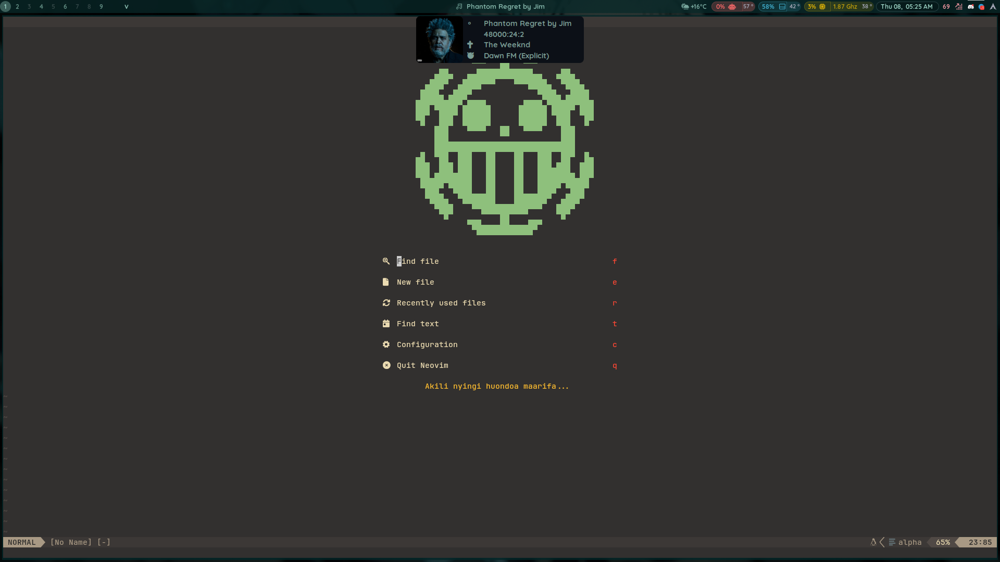
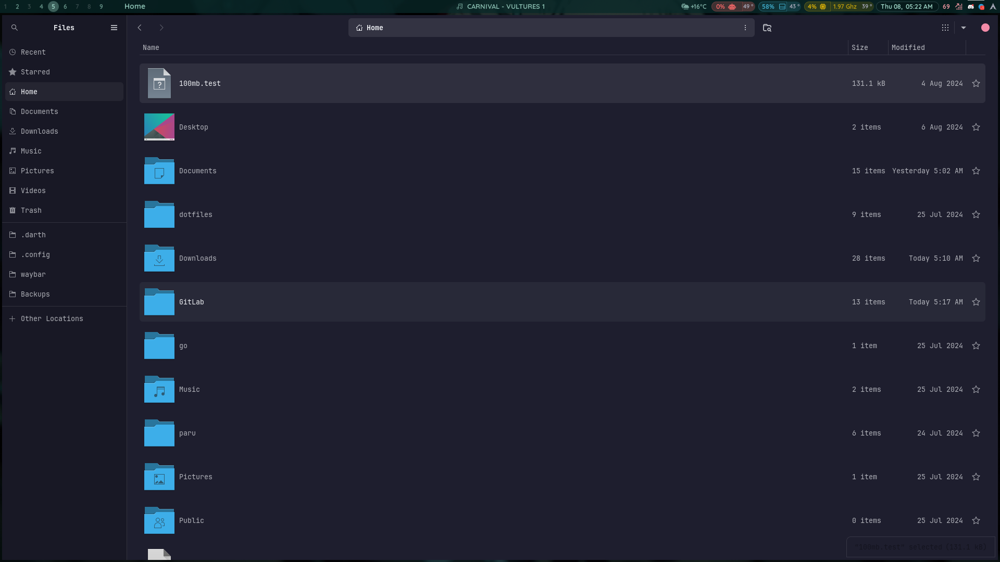
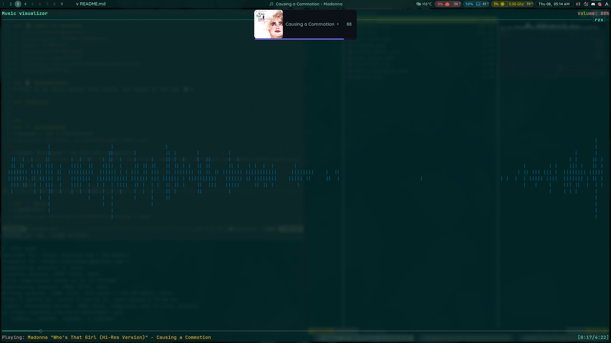
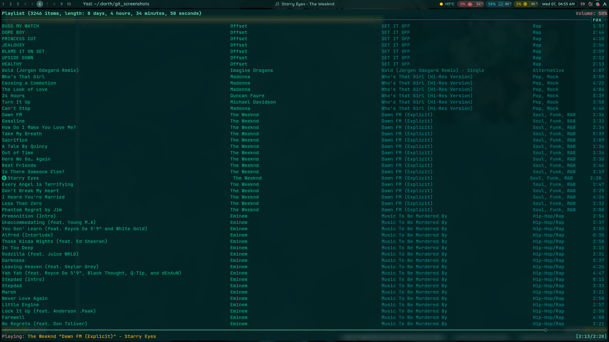
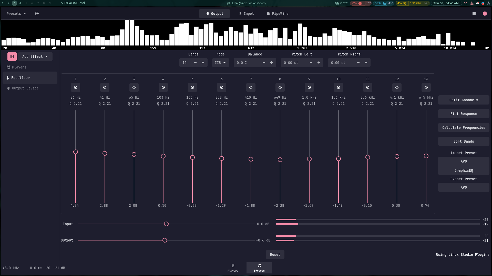

## 🌌 Hyprland + Waybar

### Table of Contents
1. [Introduction](#introduction)
2. [Screenshots 📷](#screenshots)
3. [Music 🎶](#music)
4. [Features](#features)
5. [Terminal Apps](#tui)
6. [Keyboard Shortcuts](#keyboard-shortcuts)
7. [Config ⚡](#config)

### 📝 Introduction
**This is my daily driver Arch build, min-maxed to the max 👻**

### Features 
- Theme: catppuccin-mocha-red

<details>
    <summary>Quality of life mods:</summary>

    - Adjust gaps_in and gaps_out on the fly.(see [Keyboard Shortcuts](#keyboard-shortcuts))
        - Indicators for current volume sink eg, speaker, earphones, easysink
        - Systemwide Volume progressbar with current sink icon
        - Per app (mpd, spotify etc) Volume + progressbar with waybar mpris interaction.
</details>

<details>
    <summary>Perfomance monitoring:</summary>

    - custom waybar capsules(click to open drawer):
        - Gpu (amd)
          - gpu frequency mhz
          - gpu % use
          - gpu fan rpm
          - gpu temp
          - CPU
          - temp, frequency, %use
    - memory % use and disk % free + temp
          - network(up/down speed) + weather (wttr.in)
</details>

***
### 📷 Screenshots
**Neovim**


**pacman + fzf | FastFetch**


**Empty Workspace + my perf_mon capsules**


**Nautilus**


***
### 💻 Tui
**Yazi**


### 🎶 Music
<details>
    <summary><strong>NCMPCPP<strong></summary>

    *visualizer view + dunst volume progress*
    

    *main playlist view*
    

    *playlist-editor view*
    
</details>

<details>
    <summary><strong>Easy Effects<strong></summary>

    
</details>


<details>
    <summary><strong> ⌨️  Keyboard Shortcuts</strong></summary>

    ### Keyboard Shortcuts
    ```
        #LEGEND
        $sl = SHIFT_L
        $cl = CONTROL_L
        $mod = SUPER
        $al = Alt_L
        $ar = Alt_R
        $sl = SHIFT_L

        PrtSc: Taking Screentshot - entire scrn
            * + $al - current window
            * + $sl - copy area

        $mod + Enter: Open kitty current workspace
        $mod + $sl + Enter: Open Terminal emptym

        $mod + I: launch special:nc, launch ncmpcpp if empty

        $mod + +: Inc. Gaps out
        $mod + -: Dec. Gaps out

        $mod + $al + +: Inc. Gaps in
        $mod + $al + -: Dec. Gaps in

        $mod + vim-motions (h,k,l,j) / mouse-down/up -> navigate open workspaces
        $sl, $sl -> focuscurrentlast - backandforth active


        $mod + Space/mouse:275 killactive / close focused window
        $mod + O -> Move to emptym

        $mod + {}: Launch app 
            {} = B - Brave, F - Firefox, N - Nautilus, $sl + O - obsidian


        #see also .config/hypr/workspacerules, keybindings

    ```
</details>
### ⚡ Config


