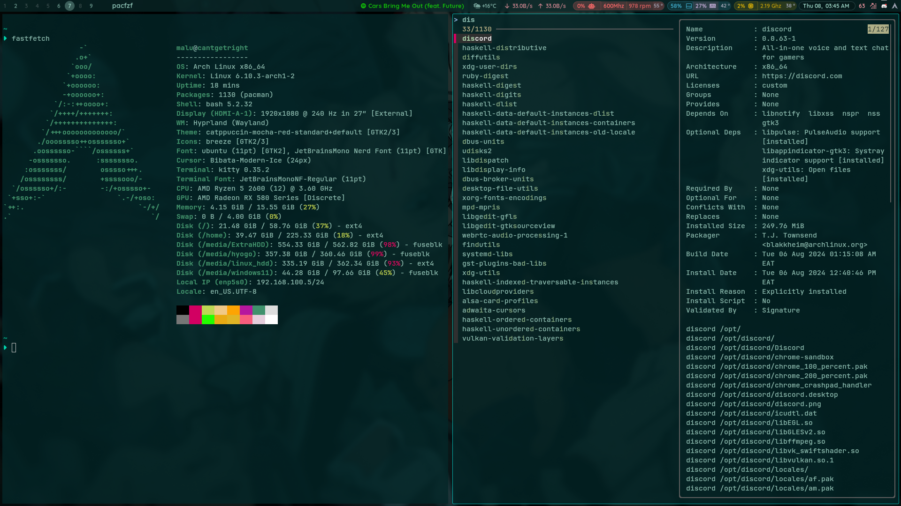
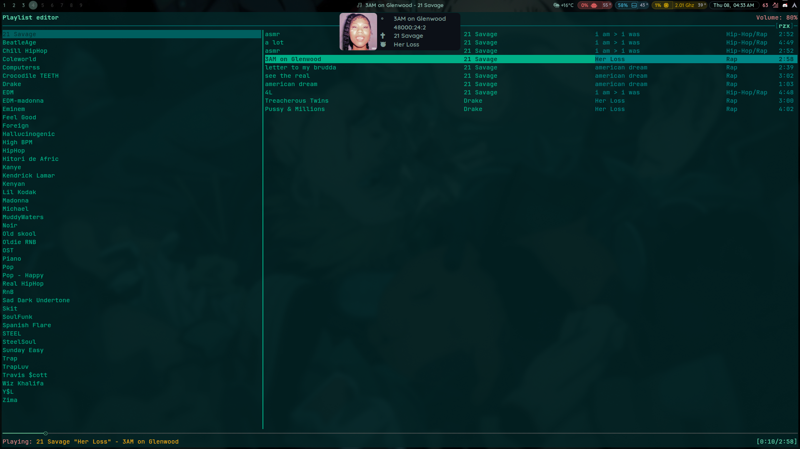
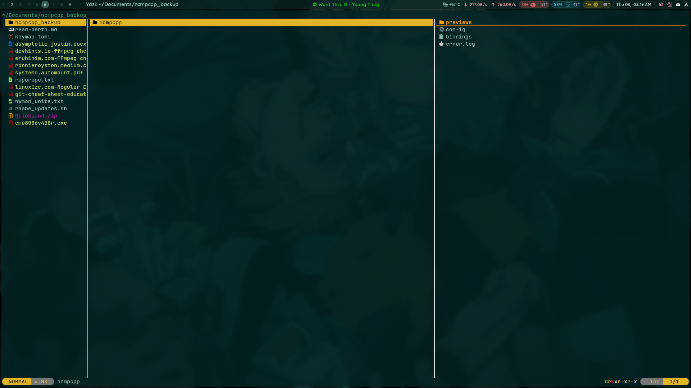

### 📜 Table of Contents

1. [Introduction](#introduction)
2. [Screenshots](#Screenshots)
3. [features](#Features)
4. [Tui](#Tui)
4. [kb](#Keyboard Shortcuts)
5. [config](#Config)

### 📝 Introduction
**This is my daily driver build, min-maxed to the max**

### Features 


### 🖼️ Screenshots
**pacman + fzf | FastFetch**


**Empty Workspace + my perf_mon capsules**


### 💻 Tui
**NCMPCPP**


**Yazi**



### ⌨️ Keyboard Shortcuts
```
    #LEGEND
    $sl - SHIFT_L
    $cl - CONTROL_L
    $mod = SUPER
    $cl = Control_L
    $al = Alt_L
    $ar = Alt_R
    $cr = Control_R
    $sl = SHIFT_L
    $sr = SHIFT_R
    $s = space


    PrtSc: Taking Screentshot - entire scrn
        * + $al - current window
        * + $sl - copy area

    $mod + Enter: Open kitty current workspace
    $mod + $sl + Enter: Open Terminal emptym

    $mod + I: launch special:nc, launch ncmpcpp if empty

    $mod + vim-motions (h,k,l,j) / mouse-down/up -> navigate open workspaces
    $sl, $sl -> focuscurrentlast - backandforth active


    $mod + Space/mouse:275 killactive / close focused window
    $mod + O -> Move to emptym

    $mod + {}: Launch app 
        {} = B - Brave, F - Firefox, N - Nautilus, $sl + O - obsidian


    #see also ./workspacerules, keybindings

```
### ⚡ Config


